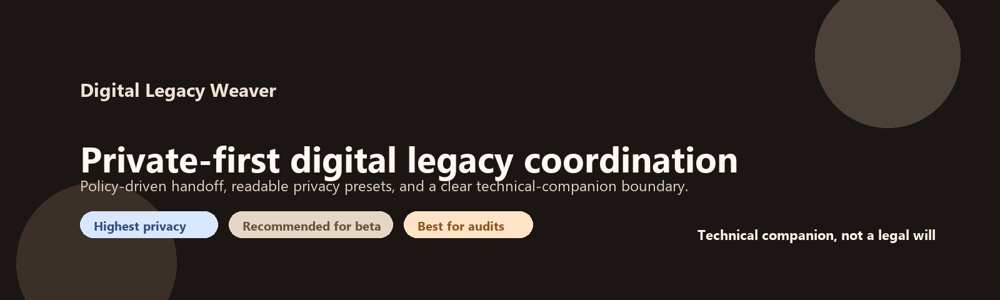

# Digital Legacy Weaver



Private-first digital legacy coordination for secure self-recovery, beneficiary delivery, and partner-ready continuity workflows.

## Why this exists

Most people now store critical value in digital systems: cloud files, crypto wallets, account recovery codes, and private instructions.

When something goes wrong, two failures happen repeatedly:

1. Owners lose access to their own accounts and recovery data.
2. Families and beneficiaries cannot find or access important digital legacy information.

Digital Legacy Weaver is built to reduce both risks with policy-driven automation and strong operational safety controls.

## What this project is

Digital Legacy Weaver is a technical coordination layer that helps manage:

1. `Self-Recovery` flow for owners.
2. `Legacy Delivery` flow for beneficiaries.
3. Partner-ready destination workflows without changing the private-first core.

## What this project is not

1. Not a legal will replacement.
2. Not a legal decision authority.
3. Not a place to email plaintext secrets.
4. Not a universal guarantee mechanism in every device/network condition.

Legal entitlement must be handled within the destination service or legal process designated by the owner.

Reliability statement:

1. The platform is designed to assist secure coordination and delivery workflows.
2. Operators should run safety controls, reminders, and incident drills before broad rollout.

## Who this is for

1. Security-focused users who need safer digital continuity.
2. Developers building digital legacy features in apps/wallets/platforms.
3. Operations teams that need auditable, policy-based release workflows.
4. Teams that need a partner-ready coordination layer for family, legal, or custodial workflows.

## Product principles

1. Private-first by default.
2. Safety before convenience.
3. Policy-as-code (`.ptn`) over hardcoded logic.
4. Observable, testable operations with incident readiness.
5. Clear legal boundary in every critical flow.

## Current maturity

Current line is `v0.1.x`: strong foundation/prototype, not full production-stable yet.

Closed-beta communication rule:

1. Always present the product as a technical companion.
2. Never present the product as a legal will or legal adjudication service.

Stability and release criteria are tracked in:

1. `docs/testing-strategy.md`
2. `docs/release-readiness-checklist.md`
3. `docs/closed-beta-checklist.md`

## Architecture

1. **Client**: Flutter app scaffold (`apps/flutter_app`)
2. **Backend**: Supabase (Postgres, Auth, Edge Functions)
3. **Policy Layer**: PTN parser/evaluator + active policy documents
4. **Dispatch Layer**: scheduled dead-man-switch logic + reminder/release stages
5. **Unlock Layer**: one-time secure link + verification code + optional TOTP
6. **Ops Layer**: safety controls, heartbeat monitoring, cleanup, security triage

High-assurance reference:

1. `docs/high-assurance-architecture.md`

## Implemented capabilities (foundation scope)

1. PTN policy model and validation tooling.
2. Supabase schema with RLS and safety-critical migrations.
3. Dispatcher with:
- inactivity thresholds
- reminder stages
- grace windows
- emergency pause handling
4. Secure unlock flow with:
- one-time access keys
- verification challenge
- consume-on-success behavior
5. Abuse protections:
- rate limits
- security event logging
- global dispatch/unlock kill switch
6. Additional risk controls:
- optional multi-signal proof-of-life gate
- optional guardian approval gate
- optional TOTP unlock requirement
7. Partner-ready handoff notice runtime with audit trail.
8. Reviewer/admin key management endpoints for controlled workflows.
9. Runtime E2E/adversarial CI checks with evidence artifacts.
10. In-app setup wizard for new users (beneficiary, trigger defaults, legal companion consent).
11. In-app beta feedback intake (UX/bug/security/reliability categories).

## Quick start (local quality gate)

```powershell
python -m pip install -r requirements-dev.txt
.\scripts\run_local_quality_gate.ps1
```

## Deploy backend

```powershell
.\scripts\deploy_production.ps1 -ProjectRef <your_project_ref>
```

Post-deploy:

```powershell
.\scripts\post_deploy_smoke.ps1 -ProjectRef <your_project_ref>
.\scripts\security_gate_preflight.ps1
```

## Runtime reliability checks

Manual:

```powershell
.\scripts\run_integration_unlock_flow.ps1 -ProjectRef <project_ref>
.\scripts\run_adversarial_unlock_checks.ps1 -ProjectRef <project_ref>
```

Automated:

1. `.github/workflows/e2e-runtime.yml`
2. Scheduled every 6 hours
3. Uploads runtime evidence artifacts

Setup guide:

1. `docs/e2e-test-pack.md`
2. `docs/github-test-secrets-setup.md`

## App release pack (downloadable binaries)

Automated release workflow:

1. `.github/workflows/app-release.yml`
2. Builds Android APK + Windows ZIP
3. Publishes GitHub Release assets

Guide:

1. `docs/app-release-pack.md`
2. `docs/releases/v0.1.0-release-notes-template.md`

## Repository map

1. App:
- `apps/flutter_app`

2. Supabase:
- `supabase/migrations`
- `supabase/functions/dispatch-trigger`
- `supabase/functions/open-delivery-link`
- `supabase/functions/manage-totp-factor`
- `supabase/functions/handoff-notice`
- `supabase/functions/review-legal-evidence` (optional legacy module, disabled by default in technical-layer mode)
- `supabase/functions/manage-reviewer-keys`

3. Specs and policy:
- `specs/partner-api.openapi.yaml`
- `specs/ptn-format.md`
- `specs/ptn-v2.md`
- `examples/default-policy.ptn`
- `examples/pdpa-policy-pack.ptn`
- `examples/high-assurance-v2-policy.ptn`
- `examples/privacy-profile-confidential.ptn`
- `examples/privacy-profile-minimal.ptn`
- `examples/privacy-profile-audit-heavy.ptn`
- `ptn/legacy` (reserved boundary for proprietary PTN legacy modules)

4. Operations and runbooks:
- `docs/production-deploy-runbook.md`
- `docs/incident-response.md`
- `docs/threat-model.md`
- `docs/testing-strategy.md`
- `docs/release-readiness-checklist.md`
- `docs/closed-beta-checklist.md`
- `docs/first-launch-execution.md`
- `docs/high-assurance-architecture.md`
- `docs/hosted-mode-operations.md`
- `docs/beta-gate-ops.md`
- `docs/beta-status-ops.md`
- `docs/beta-feedback-ops.md`
- `docs/ptn-licensing-boundary.md`

5. Scripts:
- `scripts/deploy_production.ps1`
- `scripts/post_deploy_smoke.ps1`
- `scripts/security_triage_report.ps1`
- `scripts/safety_control_drill.ps1`
- `scripts/run_integration_unlock_flow.ps1`
- `scripts/run_adversarial_unlock_checks.ps1`

6. Beta SQL packs:
- `ops/sql/beta_dashboard_pack.sql`
- `ops/sql/beta_gate_pack.sql`

## CI/CD workflows

1. `quality.yml`
2. `flutter-quality.yml`
3. `security-gate.yml`
4. `maintenance-cleanup.yml`
5. `safety-drill.yml`
6. `e2e-runtime.yml`
7. `beta-gate.yml`
8. `beta-status.yml`
9. `app-release.yml`

## Security and legal posture

1. No plaintext secret release in email.
2. One-time, expiring access links.
3. Second-factor challenge before unlock.
4. Centralized emergency controls for incident response.
5. Auditable logs for security and release workflows.
6. Explicit legal boundary: technical layer only.

See:

1. `SECURITY.md`
2. `docs/legal-companion-mode.md`
3. `docs/legal-evidence-gate.md`
4. `docs/provider-handoff-template.md`

## Positioning

This project is best presented as:

1. A **developer-first infrastructure layer** for digital legacy safety.
2. A **partner-ready coordination core** for future destination workflows.
3. A **responsible technical companion** that respects legal boundaries.

This keeps the narrative strong without over-claiming legal or production status.

Audience messaging guide:

1. `docs/positioning-audience-guide.md`

## Contributing

1. `CONTRIBUTING.md`
2. `.github/CODEOWNERS`

## Licensing Model

1. Open-core repository code and public examples:
- MIT License (`LICENSE`)

2. PTN legacy proprietary modules and related premium policy assets:
- Proprietary (`LICENSE-PTN`)
- Copying all/substantial proprietary PTN assets is not allowed without prior written permission.

3. Boundary path for proprietary PTN legacy:
- `ptn/legacy/private` is reserved and enforced by CI boundary checks.

## Private-first runtime posture

1. Sensitive payload is intended to remain on user-controlled devices.
2. Runtime traces are minimized to policy-control metadata only.
3. Trace metadata is retained for a shorter window than general operational logs.
4. CI blocks known secret-bearing logging patterns before merge.
